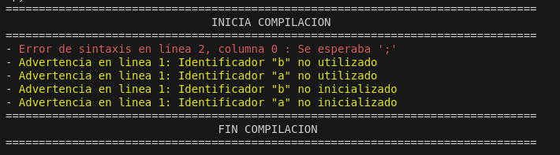
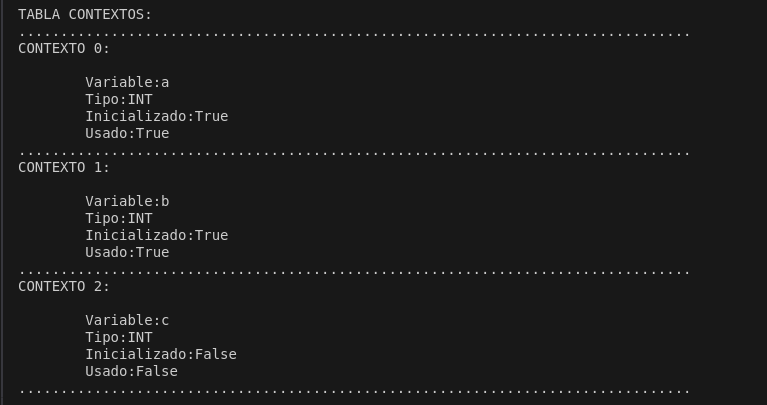
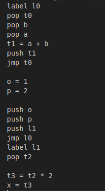

# 📌 Compilador Básico de "C"
[Carpeta principal](https://github.com/TwBenjaminVargas/DHS/tree/main/MavenDHS/dhs2024)

**Descripción corta del proyecto.**  
Proyecto final de la asignatura “Desarrollo de Herramientas de Software”, el cual consta de la realización de un compilador de C básico utilizando Python y ANTLR4.

## 🛠️ Tecnologías utilizadas

- 🖥️ Python
- 📦 ANTLR4  

## 📸 Capturas de pantalla
*Reporte de Errores*

*Reporte de contextos*

*Codigo intermedio*

## ✨ Autores

Desarrollado por [Badami, Celeste Antonella](https://github.com/AntoBadami).  
Desarrollado por [Vargas, Benjamin](https://github.com/TwBenjaminVargas).  
